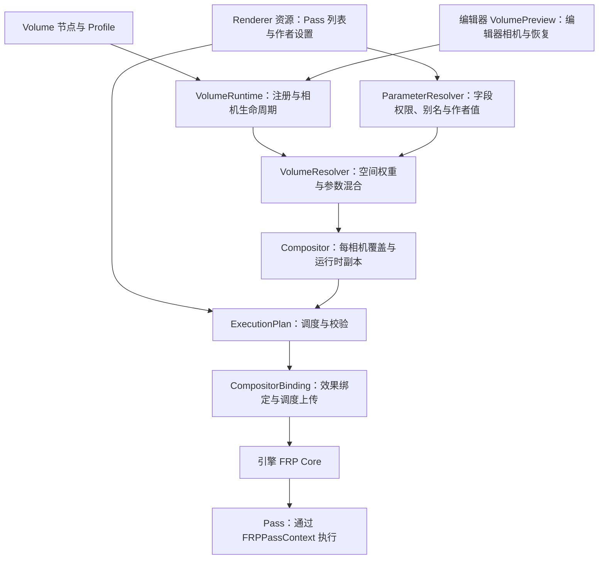

# FRP 插件架构与修改边界

本文描述当前实现；`frp-v2-urp-architecture.md` 中的早期设计草案不代表所有接口都已实现。
引擎能力及升级触点以 [引擎契约](frp-engine-contract.md) 为准。

## 数据流

## 职责与依赖

| 模块 | 负责 | 不应承担 |
| --- | --- | --- |
| `renderer.gd` | 管线资源、嵌套资源变更观察、迁移和库同步入口、兼容查询 API | RenderingServer 调度上传细节、编辑器控件、Volume 空间查找 |
| `pipeline/execution_plan.gd` | 从已初始化条目构造调度、效果索引、provided 集合并校验 | 修改资源、加载默认管线、上传 GPU 状态 |
| `pipeline/compositor_binding.gd` | 刷新附件需求、绑定效果、提交或清空调度、无效计划的执行保护 | 定义 Pass 默认值或 Volume 混合规则 |
| `pipeline/parameter_resolver.gd` | 参数来源、作者层级、代码声明的 Volume 字段权限、原生/自定义键别名 | 查找相机或编辑器、修改调用者的作者快照 |
| `compositor.gd` | 合并变更通知、保存相机覆盖、隔离运行时资源副本 | 决定 Volume 的范围、优先级或可暴露字段 |
| `volume/feng_volume.gd` | 序列化空间参数、包含关系和影响权重、生命周期注册 | 管理其他 Volume、选择相机、持有全局 compositor 状态 |
| `volume/volume_runtime.gd` | 注册表、每帧视口路由、清除消失的覆盖、编辑器/游戏共用的相机更新入口 | 编辑器 API、绘制 Gizmo、参数插值算法 |
| `volume/volume_resolver.gd` | 按稳定优先级一次采样，生成参数与 Pass 开关结果 | 写 Renderer、连接信号、调用 RenderingServer |
| `editor/volume_preview.gd` | 编辑器视图相机选择、独立临时 compositor、退出时恢复 | 重写混合规则或修改作者资源 |
| `editor/pass_library_controller.gd` | 库菜单、资源选择、条目操作与完整 UndoRedo 事务 | 安装项目管线或控制 Volume 预览 |
| `editor_plugin.gd` | 注册/卸载编辑器服务及项目管线桥接 | 实现库操作的重复算法 |

`world_compositor.gd` 集中保存引擎世界 compositor 的选择规则；`project_pipeline.gd` 集中解析项目
资源路径、UID 和默认世界安装。两者语义不同，不与检查器的“可编辑资源来源”查找混用。

## 必须保持的契约

- Pass 作者通过 `get_volume_parameter_names()` 声明允许的字段；Volume 使用者只选择模块和编辑值。
- 参数优先级为 Pass 导出值、条目覆盖、Volume 混合结果；运行时快照不能回写作者资源。
- 全局参数声明与 Volume 字段列表相互独立。`enabled` 也只有经 Pass 明确开放才可被 Volume 控制；
  值为 `false` 表示关闭效果，不能解释成跳过覆盖。旧通用开关列表不进入新 UI，并受同样的字段权限限制。
- `get_volume_context()` 按资源变更版本缓存作者值、字段元数据和别名，对外返回隔离快照。
  Pass 的参数 setter 必须按现有协议 `emit_changed()`；Renderer 观察嵌套 Pass 的变更并使缓存失效。
- 调度中的 manager 占效果索引 0；关闭的脚本 Pass 仍保留效果槽，保证 token 和效果数组对应。
- 无效调度不覆盖上一次有效调度；保护逻辑保留原生帧工作，暂停不安全的自定义效果。
- 最后一个 Volume 被移除也要清理已推送覆盖；编辑器关闭插件或切换场景要恢复相机 compositor。
- 已有 `.tres` / `.tscn` 字段、稳定 ID、Renderer 查询和 Volume 兼容入口保持有效。

新增效果优先增加 Pass 脚本与资源。需要新的底层绘制能力时，先检查 `FRPPassContext`，仅在现有
原语确实不足时扩展最小引擎接口。参数、模块权限、编辑器和 Volume 策略不得下沉至引擎。

## Volume 更新与资源寿命

- 无变化的相机仅比较轻量状态，不执行属性反射、库同步、资源重新连接和参数混合。
- 模块值、旧字典原位修改、范围、权重、优先级和管线资源版本变化都会触发重新求值；无界 Volume
  不因相机移动而重算，有限 Volume 按相机位置更新。
- 编辑器跳过隐藏视图；范围外恢复原相机 compositor，不为无影响的相机创建运行时 Renderer。
- 每相机运行时副本在离开范围时保持可复用，避免往返边界反复创建/释放 shader 和 GPU pipeline。
  管线作者资源变更时才失效；切换场景、移除 Volume 或卸载插件会清理预览持有的资源。
- 缓存不持有相机的强引用；Volume 不读写输入映射或相机位置、旋转。

## 验证

`python misc/scripts/test_frp_pipeline.py --driver d3d12` 在隔离项目中验证真实 GPU 帧、调度及资源
契约、TAA、后处理、项目设置、参数隔离、Volume 生命周期、编辑器预览像素与 UndoRedo，并检查
`forward_plus` 不受影响。编辑器测试必须作为 EditorPlugin 加载，不能用 `--script` 启动。
