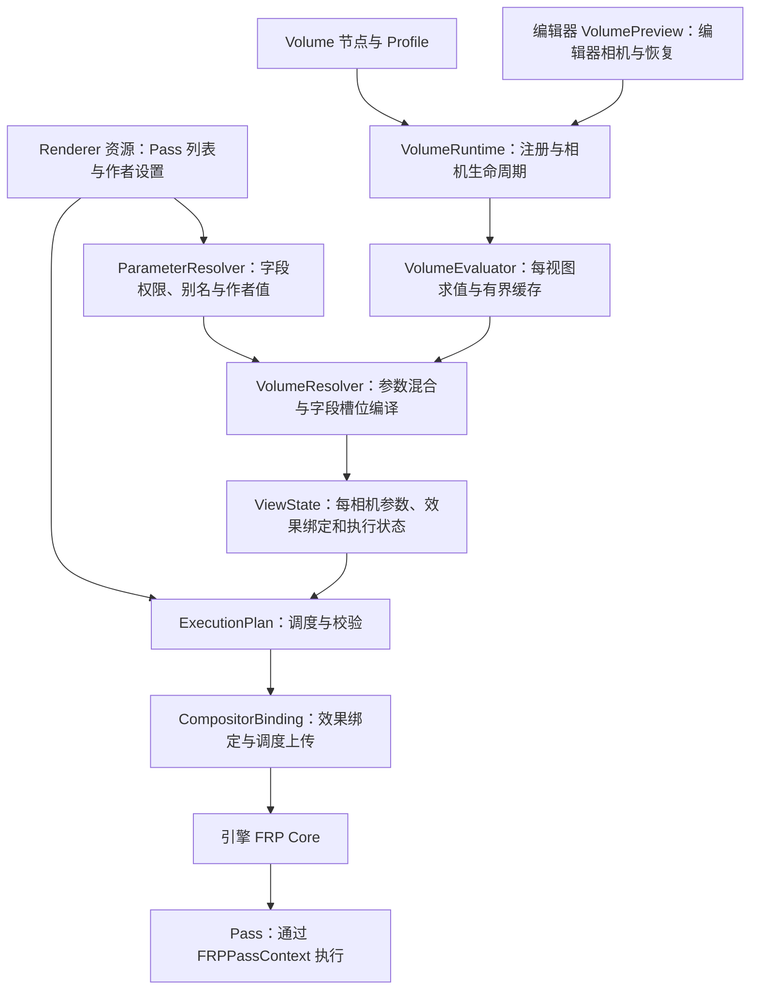

# FRP 插件架构与修改边界

本文描述当前实现；`frp-v2-urp-architecture.md` 中的早期设计草案不代表所有接口都已实现。
引擎能力及升级触点以 [引擎契约](frp-engine-contract.md) 为准。

## 数据流

## 职责与依赖

| 模块 | 负责 | 不应承担 |
| --- | --- | --- |
| `renderer.gd` | 管线资源、嵌套资源变更观察、迁移和库同步入口、兼容查询 API | RenderingServer 调度上传细节、编辑器控件、Volume 空间查找 |
| `pipeline/execution_plan.gd` | 从已初始化条目构造调度、效果索引、provided 集合并校验 | 修改资源、加载默认管线、上传 GPU 状态 |
| `pipeline/compositor_binding.gd` | 刷新附件需求、绑定效果、提交或清空调度、无效计划的执行保护 | 定义 Pass 默认值或 Volume 混合规则 |
| `pipeline/parameter_resolver.gd` | 参数来源、作者层级、代码声明的 Volume 字段权限、原生/自定义键别名 | 查找相机或编辑器、修改调用者的作者快照 |
| `compositor.gd` | 合并变更通知、保存相机覆盖、持有 ViewState | 决定 Volume 的范围、优先级或可暴露字段 |
| `pipeline/view_state.gd`、`view_pass.gd` | 每相机参数、独立效果 RID、纹理管理与有状态 Pass 实例 | 深复制整套 Renderer、回写作者开关 |
| `volume/feng_volume.gd` | 序列化空间参数、包含关系和影响权重、生命周期注册 | 管理其他 Volume、选择相机、持有全局 compositor 状态 |
| `volume/volume_runtime.gd` | 注册表、每帧视口路由、清除消失的覆盖、编辑器/游戏共用的相机更新入口 | 相机求值缓存细节、编辑器 API、参数插值算法 |
| `volume/volume_evaluator.gd` | 单视图配置和影响采样、两份结果缓存、一份预编译混合表 | 相机/视口发现、Compositor 写入、编辑器 API |
| `pipeline/view_execution_policy.gd` | 默认实现共享策略、自定义 Pass 显式共享协议 | 管线资源迁移、参数混合、每帧调度 |
| `volume/volume_resolver.gd` | 按稳定优先级一次采样，生成参数与 Pass 开关结果 | 写 Renderer、连接信号、调用 RenderingServer |
| `editor/volume_preview.gd` | 编辑器视图相机选择、独立临时 compositor、退出时恢复 | 重写混合规则或修改作者资源 |
| `editor/pass_library_controller.gd` | 库菜单、资源选择、条目操作与完整 UndoRedo 事务 | 安装项目管线或控制 Volume 预览 |
| `editor_plugin.gd` | 注册/卸载编辑器服务及项目管线桥接 | 实现库操作的重复算法 |

`world_compositor.gd` 集中保存引擎世界 compositor 的选择规则；`project_pipeline.gd` 集中解析项目
资源路径、UID 和默认世界安装。两者语义不同，不与检查器的“可编辑资源来源”查找混用。

## 必须保持的契约

- Pass 作者通过 `get_volume_parameter_names()` 声明允许的字段；Volume 使用者选择模块、编辑值和选择覆盖项，不能扩大字段权限。
- 参数优先级为 Pass 导出值、条目覆盖、Volume 混合结果；运行时快照不能回写作者资源。
- 全局参数声明与 Volume 字段列表相互独立。`enabled` 也只有经 Pass 明确开放才可被 Volume 控制；
  值为 `false` 表示关闭效果，不能解释成跳过覆盖。旧通用开关列表不进入新 UI，并受同样的字段权限限制。
- `get_volume_context()` 按资源变更版本缓存作者值、字段元数据和别名，对外返回隔离快照。
  Pass 的参数 setter 必须按现有协议 `emit_changed()`；Renderer 观察嵌套 Pass 的变更并使缓存失效。
- 调度中的 manager 占效果索引 0；关闭的脚本 Pass 仍保留效果槽，保证 token 和效果数组对应。
- 无效调度不覆盖上一次有效调度；保护逻辑保留原生帧工作，暂停不安全的自定义效果。
- 最后一个 Volume 被移除也要清理已推送覆盖；编辑器关闭插件或切换场景要恢复相机 compositor。
- 已有 `.tres` / `.tscn` 字段、稳定 ID、Renderer 查询和 Volume 兼容入口保持有效。

新增效果优先增加 Pass 脚本与资源。需要新的底层绘制能力时，先检查 `FRPPassContext`，仅在现有
原语确实不足时扩展最小引擎接口。参数、模块权限、编辑器和 Volume 策略不得下沉至引擎。

## 扩展与变更传播边界

- Renderer 保留资源入口、迁移、默认实现清单及旧查询/应用 API，具体的共享判定委托给
  `ViewExecutionPolicy`。第三方通过 `FengPass.can_share_view_execution()` 显式声明可共享，
  不必向 Renderer 添加脚本判断；默认隔离，原生实现携带 overlay 时继续保守隔离。
  共享声明覆盖整个携带的执行对象图，不能保留跨视图可变状态。
- 输入/输出声明自身发出 `changed`；Pass 观察其声明资源并向上转发；Renderer 只观察 Pass
  协议，不需要认识每种纹理声明类型。替换数组会断开旧依赖，重复赋相同声明值不使缓存失效。
  直接原位增删声明数组后，脚本应重新赋值数组；不通过每帧遍历来发现这种作者操作。
- Shader 文件及其重导入内容、执行模式、工作组大小和 dispatch target 的变更通知向上传播，
  GPU 对象仍在原有渲染线程路径按需更新。`raster_target`、`target_name` 和
  `set_shader_keyword()` 同时被原生 overlay 用于运行时配置，保留现有无通知语义；作者脚本
  修改这些字段需要显式发出 `changed`，不能在渲染回调中触发作者状态重建。
- `VolumeEvaluator` 只使用设置来源的 `get_instance_id()`、`get_parameter_revision()`、
  `get_volume_context()` 协议和空间采样输入，不持有相机或 compositor。Runtime 负责弱引用、
  注册和结果提交。每视图缓存独立，求值器可在不创建相机或 compositor 的情况下测试。
- 为兼容旧资源，Renderer 的旧 Volume 查询/应用 API 继续保留。新相机覆盖由 Compositor 的
  ViewState 持有；不能把兼容 API 当作多个相机共享可变状态的入口。

这些边界不增加逐帧依赖扫描。共享判定在创建执行实例时运行，声明观察仅在资源赋值时建立；
Volume 无变化路径仍在构建混合权重字典、查询作者上下文及清扫弱引用之前返回。

## Volume 更新与资源寿命

- 无变化的相机仅比较轻量状态，不执行属性反射、库同步、资源重新连接和参数混合。
- 模块值、旧字典原位修改、范围、权重、优先级和管线资源版本变化都会触发重新求值；无界 Volume
  不因相机移动而重算，有限 Volume 每帧采样影响权重；相机位置变化但权重不变时也不重新混合。
- 编辑器跳过隐藏视图；范围外恢复原相机 compositor，不为无影响的相机创建运行时 Renderer。
- 每相机 ViewState 在离开范围时保持可复用，不再深复制 Renderer。默认无 overlay 的原生
  Pass 与精确类型为 FengShaderPass 的标准 Pass 共享执行对象；后者共享 GPU 程序，参数通过
  当前 FRPPassContext 读取。自定义子类和带 overlay 的原生条目保守地按 Pass 隔离执行实例。
  每个视图都有独立的效果 RID、开关和 TextureManager，输出纹理仍归属各自 RenderSceneBuffers。
  作者资源变化使视图计划失效；切换场景、移除 Volume 或卸载插件会清理预览持有的资源。
- Renderer 按作者版本和开关集合缓存最多两份只读视图计划。Volume 编译使用传入的相机
  开关，不修改 Renderer 的作者参数或原始效果 RID。数值变化只更新该视图的最终参数字典。
- Volume 仅改变参数数值时复用上次成功绑定的调度及作者参数快照，只上传解析后的参数；
  作者资源版本、目标 compositor 或 Pass 开关变化时重新完整校验。进入/退出时同时恢复对应
  效果 RID 列表，不能只切换调度 token。无效调度不进入缓存。
- Volume 模块按参数值、开关与来源资源版本缓存字段过滤结果，对外仍返回隔离快照。
  字典原位修改与来源 `changed` 均使缓存失效，权限不会因缓存而扩大。
- 模块支持逐字段 `overrides/字段名` 开关，关闭后保留编辑值但不参与覆盖；旧资源默认全部覆盖。
  运行时按配置编译字段槽位、别名、权限及离散混合规则，连续移动时直接混合槽位，最后生成参数字典。
  首次编译有额外准备成本；公开字典的原位编辑检测仍保留，编辑器与游戏使用同一相机求值入口。
- 每相机最多保留两个最近的影响状态及混合结果，固定预设进出可直接复用；缓存键包含所有
  Volume 配置、来源管线版本和各 Volume 的实际影响权重，连续移动不会无限积累缓存。
  Renderer 同时保留上次解析的上传参数，预设未变时进出只恢复效果绑定并重新提交调度与参数。
- 范围外 Volume 只采样空间影响，不遍历 Profile 字段；进入时先读取当前字段版本再查缓存，
  因而范围外修改预设不会恢复旧值。范围内仍保留原位字典修改检查，不以降低更新频率换性能。
- 连续混合把配置与权重分开：配置未变时复用排序、Profile 参数和作者上下文，只重新计算
  权重插值。空间影响每帧只采样一次，传给混合器复用；优先级、范围、字段值、来源版本或
  活跃集合变化都会重建准备数据。每相机只保留一份准备数据，不积累位置历史。
- Pass 仅缓存属性结构，导出参数值始终实时读取；`property_list_changed` / `script_changed`
  使结构、管线与模块缓存失效。没有 Volume 字段的 Pass 不做 Volume 属性反射。
- Renderer 默认 Pass 延迟到首次使用时创建，加载和深复制已有资源不会创建随后被覆盖的默认
  Pass。一次完整 apply 只初始化一次，共用参数快照与别名绑定表；完整 apply 仍重新采集作者值，
  Pass 开关、依赖校验和无效调度保护不跳过。
- 缓存不持有相机的强引用；Volume 不读写输入映射或相机位置、旋转。

## 验证

场景注册 Volume 后，Godot 的 Debugger > Monitors 提供 `volume/runtime_cpu_ms`、
`volume/editor_cpu_ms`、`volume/apply_cpu_ms` 和 `volume/total_cpu_ms`。
单位为每个 process frame 的主线程耗时毫秒，读取上一完整帧；同帧多相机累加。
分别覆盖运行时注册表路由与求值、编辑器预览更新、Volume 覆盖触发的延迟管线应用。
无工作帧归零，最后一个 Volume 移除时注销指标。计时使用墙钟，包含同步调用等待，
不包含 GPU 执行、渲染线程后续工作或效果本身每帧的绘制耗时，也不是操作系统 CPU 百分比。

`python misc/scripts/test_frp_volume_cpu.py` 创建隔离工程，测量 1/10/100 个重叠 Volume 的
静止、混合区移动、范围外移动、无界相机移动和反复进出；每项预热 20 帧、采样 120 帧，
日志记录求值、延迟应用和合计的均值/P95/最大值。`--profile` 额外记录 Renderer 内部累计耗时。
另记录预先配置 TAA 开启的固定预设首次进入、首次退出、再次进入的单次耗时，以及预热后
反复启用/退出该预设的统计。连续混合使用不断变化的位置，避免交替两个位置只命中缓存。
稳定阶段的数值不代表首次创建视图绑定/自定义执行实例或作者资源变更时的成本。

`python misc/scripts/test_frp_pipeline.py --driver d3d12` 在隔离项目中验证真实 GPU 帧、调度及资源
契约、TAA、后处理、项目设置、参数隔离、Volume 生命周期、编辑器预览像素与 UndoRedo，并检查
`forward_plus` 不受影响。编辑器测试必须作为 EditorPlugin 加载，不能用 `--script` 启动。
