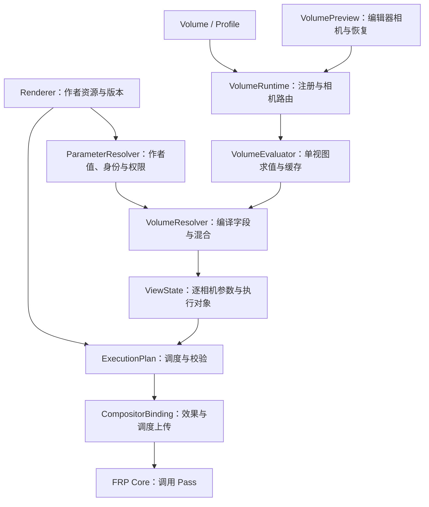

# FRP 插件架构

插件负责管线资源、Pass 参数、Volume、库同步和编辑器交互；引擎提供渲染原语和帧数据。
对外使用方式见 [插件说明](../misc/feng-addons/feng-render-pipeline/README.md)，
底层接口见 [引擎契约](frp-engine-contract.md)。

## 数据流

```mermaid
flowchart TD
    A[Renderer：作者资源与版本] --> B[ExecutionPlan：调度与校验]
    B --> C[CompositorBinding：效果与调度上传]
    C --> D[FRP Core：调用 Pass]
    E[Volume / Profile] --> F[VolumeRuntime：注册与相机路由]
    F --> G[VolumeEvaluator：单视图求值与缓存]
    G --> H[VolumeResolver：编译字段与混合]
    A --> I[ParameterResolver：作者值、身份与权限]
    I --> H
    H --> J[ViewState：逐相机参数与执行对象]
    J --> B
    K[VolumePreview：编辑器相机与恢复] --> F
```

## 模块所有权

| 模块 | 职责 |
|---|---|
| `renderer.gd` | 作者资源、嵌套变更观察、延迟初始化、迁移/同步入口和兼容查询 API |
| `pipeline/native_spec.gd` | 读取引擎原生规范，集中纹理 scope、名字和必要的 ID 常量 |
| `rd/owned_rids.gd`、`rd/shader_source.gd`、`rd/uniforms.gd` | 无状态低层值操作：有序 RID 去重、相对 shader include 展开、标准 RDUniform 构造；不依赖 Pass、Fog 或 Cloud |
| `pipeline/library_manager.gd` | 库清单、默认开关、锚点、实例身份和删除记录 |
| `pipeline/pipeline_migrator.gd` | 旧资源格式、原生 ID 及严格匹配的默认云/雾顺序迁移 |
| `pipeline/execution_plan.gd`、`pipeline_validator.gd` | 从已初始化条目构造 effects/token/provided，检查调度与纹理依赖 |
| `pipeline/compositor_binding.gd` | 附件需求、效果绑定、RenderingServer 上传及无效计划保护 |
| `pipeline/parameter_resolver.gd` | 作者参数、稳定键/别名和代码声明的 Volume 字段权限 |
| `compositor.gd`、`pipeline/view_state.gd`、`view_pass.gd` | 合并资源通知，保存每相机参数、独立效果 RID、纹理管理和执行状态 |
| `pipeline/view_execution_policy.gd` | 标准实现共享规则与自定义 Pass 显式共享协议 |
| `volume/feng_volume.gd` | 空间范围、权重和生命周期注册 |
| `volume/volume_runtime.gd` | 注册表、弱引用、视口/相机路由、结果提交和消失覆盖清理 |
| `volume/volume_evaluator.gd` | 单视图采样、配置准备和有界结果缓存 |
| `volume/volume_resolver.gd` | 优先级排序、字段槽位编译和参数/开关混合 |
| `editor/volume_preview.gd` | 编辑器视图选择、临时 compositor 和退出恢复 |
| `editor/pass_library_controller.gd` | 库菜单、条目操作、资源选择与完整 UndoRedo 事务 |
| `passes/snapshot_worlds.gd` | viewport → World3D → render target 的共享查询与缓存 |
| `editor_plugin.gd`、`project_pipeline.gd` | 编辑器服务、项目路径/UID 解析与默认世界安装 |
| `world_compositor.gd` | 世界 compositor 选择规则，包括引擎 WorldEnvironment 分组约定 |

ExecutionPlan、校验器和绑定直接消费 FengPass 的类型化契约（准备、契约来源、参数与开关）。
ExecutionPlan 和 VolumeResolver 根据输入生成结果，不改作者资源或调用 RenderingServer。
VolumeEvaluator 只依赖位置、Volume 配置以及设置来源的 `get_instance_id()`、
`get_parameter_revision()`、`get_volume_context()` 协议，可独立于相机和 compositor 测试。
项目默认世界选择与 Inspector 的可编辑资源来源查询分别处理。

## 参数与变更传播

Pass 通过 `get_frp_parameters()` 声明全局参数，通过 `get_volume_parameter_names()`
开放 Volume 字段。两份声明独立；Profile、模块和旧字典均按当前字段权限过滤。
参数层次为作者值 → 条目覆盖 → Volume 结果，运行时快照保持与作者资源隔离。

`enabled` 作为 Volume 字段也需要 Pass 明确开放；`false` 是关闭覆盖。
模块的 `overrides/字段名` 控制是否参与混合，关闭后保留编辑值。连续字段插值，离散字段
在权重达到 0.5 时切换，同优先级使用稳定注册顺序。

变更通过资源信号传播：

1. 输入/输出声明发出 `changed`，Pass 观察并向上转发
2. Renderer 观察 Pass 及其 `carried_passes()`，更新参数版本并使计划失效
3. Compositor 合并通知后刷新自己的 ViewState 和绑定

参数 setter 应调用 `emit_changed()`；声明数组原位增删后重新赋值，以重建依赖观察。
Shader 重导入、执行模式、工作组和 dispatch target 的作者变更走同一通知链。
`raster_target`、`target_name`、`set_shader_keyword()` 也用于渲染回调中的 overlay 配置，
保留无作者通知语义；作者脚本修改这些字段时显式发出 `changed`。

Pass 仅缓存属性结构，读取参数时获取实时导出值。`property_list_changed` / `script_changed`
使结构及关联缓存失效；没有 Volume 字段的 Pass 跳过 Volume 属性反射。
Renderer 的 `get_volume_context()` 按参数版本缓存作者值、元数据和别名，对外返回隔离快照。

## 逐视图执行与生命周期

每个 FengCompositor 的 ViewState 持有独立参数、开关、效果 RID 和 TextureManager。
纹理由各自 RenderSceneBuffers 持有。相机可共享 Renderer 作者资源，运行时结果保持独立。
Pass 自有 RD 资源通过 `_take_owned_rids()` 逐层转移并清空，显式清理与析构共用同一份
所有权声明；延迟释放只捕获 RID，不依赖已销毁的 Pass。Shader 热重载只转移依赖 shader
的对象，保留 sampler；Cloud 的命名纹理 scope 仍由 FengCloudGPU 的清理包管理。
借用的帧/producer RID 仍由原所有者释放。

ViewExecutionPolicy 允许精确类型的标准 FengShaderPass、无 overlay 的标准原生实现共享
执行对象。自定义 Pass 默认隔离；顶层条目通过 `can_share_view_execution()` 显式承担
整个携带对象图的共享安全责任，逐视图状态应从上下文读取。

VolumeRuntime 持有注册及路由，VolumePreview 选择编辑器相机，两者共用单视图求值器。
隐藏编辑器视图跳过预览；无影响时恢复原 compositor；退出范围时保留可复用的 ViewState。
最后一个 Volume 移除、切换场景或卸载插件时清理覆盖、临时绑定和预览资源。
缓存不强持有相机，也不修改相机变换或输入映射。

## 缓存与更新成本

缓存按配置、影响权重和作者版本分层：

- 每视图 VolumeEvaluator 保留一份编译字段表和两份最近结果；移动时只重算影响并混合字段槽位
- 范围外只采样空间影响；进入时读取当前 Profile 版本，再查结果缓存
- 无界 Volume 不因相机位置变化重混合；有限 Volume 每帧采样一次影响，权重未变时复用结果
- 优先级、活跃集合、范围、字段值和管线版本变化会重建准备数据；公开字典原位修改通过哈希检测
- Renderer 按作者版本和开关集合保留最多两份有效视图计划；数值变化复用已验证绑定，仅更新参数
- 作者资源、目标 compositor 或 Pass 开关变化触发完整校验；进入/退出同时恢复效果列表与调度
- Renderer 默认 Pass 首次使用时创建，避免加载或复制已有资源时创建临时默认列表

无效计划不进入缓存，也不覆盖引擎上次有效调度。绑定保护暂停不安全的自定义效果，
保留原生帧工作。Texture Manager 固定占 effects 索引 0，关闭的脚本条目保留效果槽。

## 可选效果的数据边界

Magic GI、Height Fog 等消费者通过软加载访问可选 producer runtime，再按当前 render target
匹配快照。`snapshot_worlds.gd` 提供共享世界/目标查询；producer 的参数、发布和选择仍由其
runtime 拥有。未安装消费者插件时，producer 可继续自己的工作。

Magic GI 在数据 identity、cache key 或版本变化时验证并上传 PRT 传输/几何 atlas 与有符号
格索引；太阳/环境变化只更新 SH 和相机数据。查询在世界空间进行，检查附近 27 个格、
每格最多 8 个样本，用法线和平面距离选取最近四点插值，最后乘接收表面的
`albedo * (1 - metallic) * AO`。传输不包含接收材质和当前直接光。
v4 烘焙将 primary SkyLight 可见性与 secondary transport 分开，按覆盖权重替换全局漫反射；
v2/v3 保留 additive 行为。无匹配有效烘焙时贡献纹理清零，场景 HDR 保持原值。

`FengVolumetricCloudPass` 统一拥有 FengCloudGPU 及清理生命周期；Shadow、Trace 和
Composite 保留各自阶段行为。即时清理与渲染线程延迟清理共用资源释放入口。
FengCloudGPU 使用已绑定的 FRPPassContext 类型化接口；外部快照长度、有限值、RID 和
材质身份仍在边界校验。Height Fog 的普通视口与冻结捕获共用执行流程，输入快照和
捕获曝光归一化由各自来源提供。

FengSkyLight 在原生捕获状态同步时统一更新 render-target 路由，持有自己的注册并在
目标消失或节点退出时释放。Fog、Cloud 等跨插件来源保持可选加载；同插件内部接口
按明确类型调用。

Debug Buffers 的输入契约由 buffer 选择决定，因此选择项属于作者配置。
`motion_scale` 与 `gi_exposure` 从最终参数读取，但不开放给 Volume。
启用时在 Post Process 后显示原始缓冲；关闭时不分配自己的输出或 dispatch。
缺少 Magic GI 时其诊断图为黑色。

## 扩展与验证

当前固定 D3D12 运行样本的条件、结果和限制见 [FRP runtime performance (2026-10-10)](frp-performance-20261010.md)。

新增效果添加 Pass 脚本、资源及需要的库清单项。字段权限写在 Pass；空间混合写在
VolumeResolver；编辑器操作写在对应 controller。现有 Core 无法表达底层工作时，
再按引擎契约增加接口。已有资源字段、稳定 ID 和兼容查询入口继续由迁移层维护。

Debugger → Monitors 提供 `volume/runtime_cpu_ms`、`volume/editor_cpu_ms`、
`volume/apply_cpu_ms`、`volume/total_cpu_ms`。它们累计上一完整 process frame 的主线程
墙钟耗时，包括同步等待，不含 GPU 或后续渲染线程工作；无工作帧归零，最后一个 Volume
移除时注销。

- `python misc/scripts/test_frp_volume_cpu.py`：1/10/100 个重叠 Volume 的静止、移动、范围外、
  无界及反复进出；报告预热后均值/P95/最大值，并单独记录固定预设首次绑定成本
- `python misc/scripts/test_frp_pipeline.py --driver d3d12`：真实帧、调度/纹理、参数隔离、
  Volume 生命周期、编辑器预览、UndoRedo 及 forward_plus 对照；另用 `--driver vulkan` 验证后端

编辑器测试需作为 EditorPlugin 加载；`--script` 和无 GPU 的 headless 运行不覆盖编辑器图形预览。
